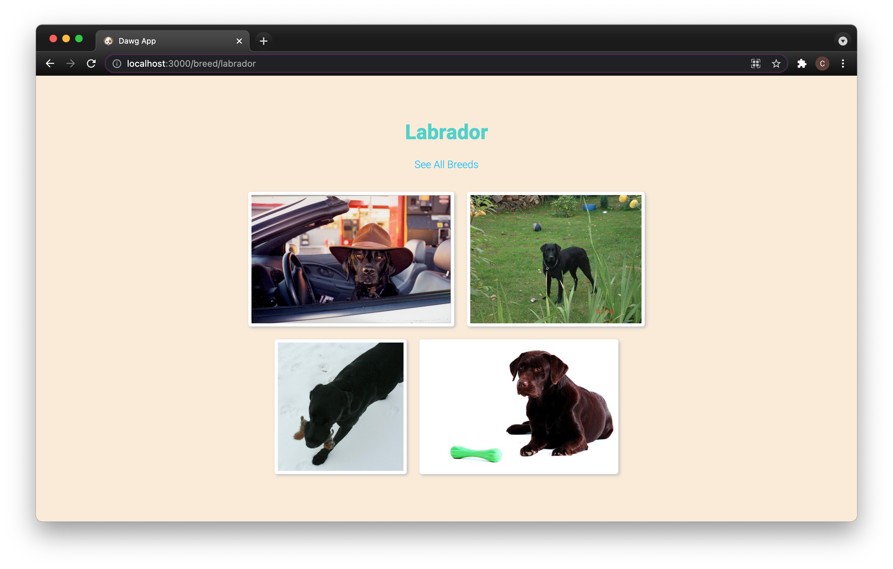

# Dawg App
Dawg App is an app that displays a list of dog breeds using the [Dog API](https://dog.ceo/dog-api/documentation/). Users can search and select a dog breed. Once a dog breed is selected, it takes the user to a separate page showing four random images of the breed. 

## Screenshots

#### Technologies
`React.js`

## Installation 
Clone this repository:\
`git clone https://github.com/cmillecan/dawg-app.git`

From the project root directory:

Download dependencies: `npm install`

Run app: `npm run start`

## Testing

`npm run test`

